# Grafos 1

¿Qué es un grafo? Es una forma representar _conexiones_ entre objetos. Por ejemplo, las relaciones de amistad entre personas.

El problema real que originó la teoría de grafos fue el [Problema de los puentes de Königsberg](https://es.wikipedia.org/wiki/Problema_de_los_puentes_de_K%C3%B6nigsberg){target="_blank"}. Que consiste en encontrar un camino que pase por todos los puentes de la ciudad de Königsberg. Pero no puede pasar por el mismo puente dos veces.

=== "Imagen de los puentes"

    

=== "Vista con grafos"

    

Un grafo $G$ consiste de un conjunto de nodos $V$ y un conjunto de aristas $E$. Las aristas conectan (relacionan) dos nodos.

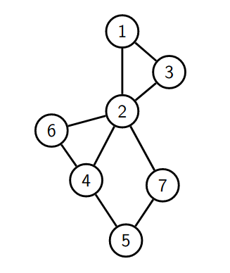{: class="image-center"}

En el campamento sólo vamos a ver grafos simples. Es decir, que no contienen _loops_ (aristas que conectan a un nodo consigo mismo) ni _aristas paralelas_ (más de una arista que conectan el mismo par de nodos).

=== "Ejemplo de grafo con loops"

    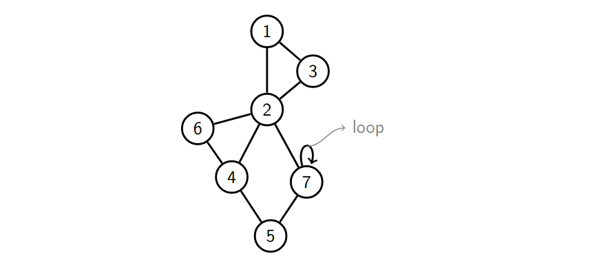{: class="image-center"}

=== "Ejemplo de grafo con aristas paralelas"

    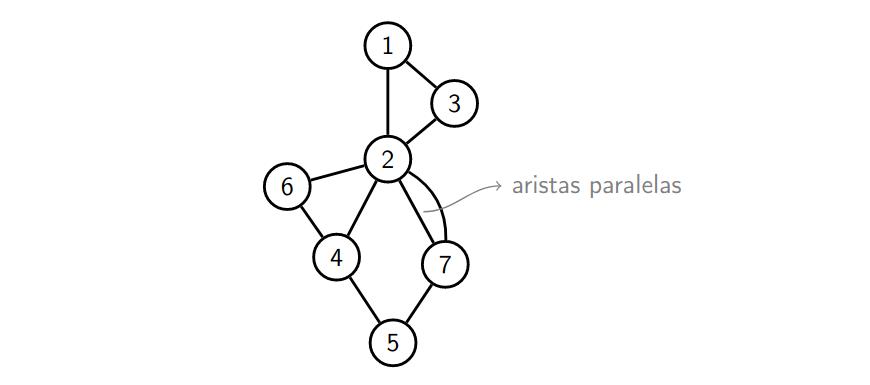{: class="image-center"}

## Grafos dirigidos y no dirigidos

Las aristas pueden ser dirigidas o no dirigidas. Si son dirigidas, la arista va de un nodo a otro con un único sentido. Si no son dirigidas, la arista va de un nodo a otro en ambos sentidos.

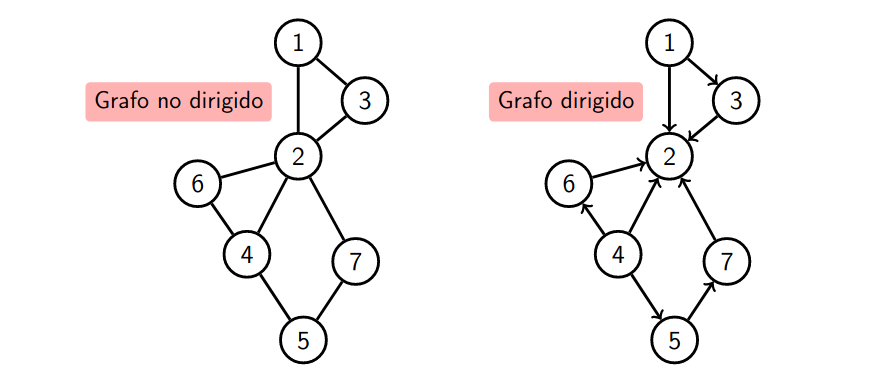{: class="image-center"}

## Caminos en grafos

También existe la noción de un recorrido a través de un grafo.

=== "Grafo original"

    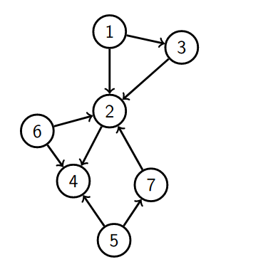{: class="image-center"}

=== "Camino"
    > El **camino** es una secuencia de nodos (distintos) unidos por aristas.

    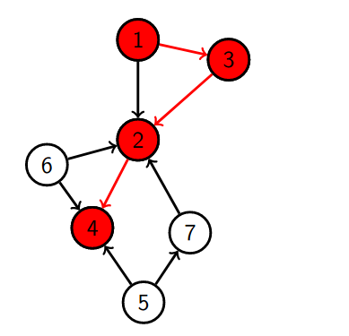{: class="image-center"}
    
    
    En este ejemplo el camino es: $1 \rightarrow 3 \rightarrow 2 \rightarrow 4$.

=== "Largo del camino"

    > El **largo** del camino es la cantidad de aristas que tiene el camino.

    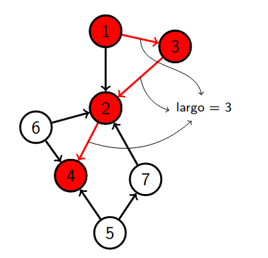{: class="image-center"}

=== "Distancia entre dos nodos"
    > La **distancia** entre dos nodos es el camino más corto entre dos nodos.

    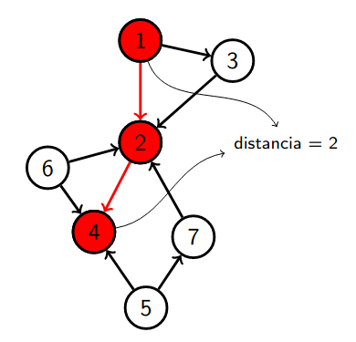{: class="image-center"}

    Puede haber multiples caminos que llevan de $1$ a $4$ pero se toma siempre el de menor largo para definir la distancia.

- - -

## Grafo conexo

Un grafo es conexo si existe un camino entre cada par de nodos. Desde cualquier nodo se puede llegar a cualquier otro.

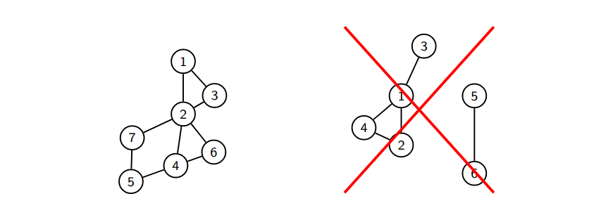{: class="image-center"}

## Ciclo

Un ciclo (simple) es un camino que empieza y termina en el mismo nodo.

=== "Grafo original"

    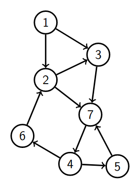{: class="image-center"}

=== "Ciclo"

    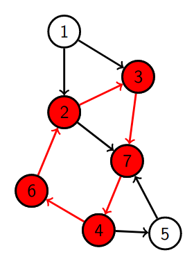{: class="image-center"}

    El ciclo que se forma es: $2 \rightarrow 3 \rightarrow 7 \rightarrow 4 \rightarrow 6 \rightarrow 2$.

- - -

## Árboles

Un árbol es un grafo conexo sin ciclos. Tiene muchas definiciones equivalentes.

=== "Árbol desordenado"

    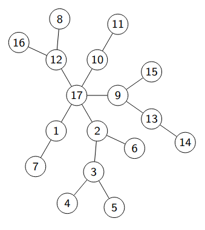{: class="image-center"}

=== "Árbol con vista jerárquica"

    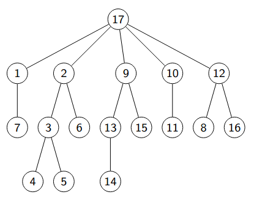{: class="image-center"}

## Formas de representar grafos

### Matriz de adyacencia

La matriz de adyacencia es una matriz cuadrada de $|V|$ por $|V|$, donde $|V|$ es la cantidad de nodos. Si hay una arista del nodo $i$ al nodo $j$, entonces en la posición $(i,j)$ de la matriz hay un 1. Si no hay una arista, entonces hay un 0.

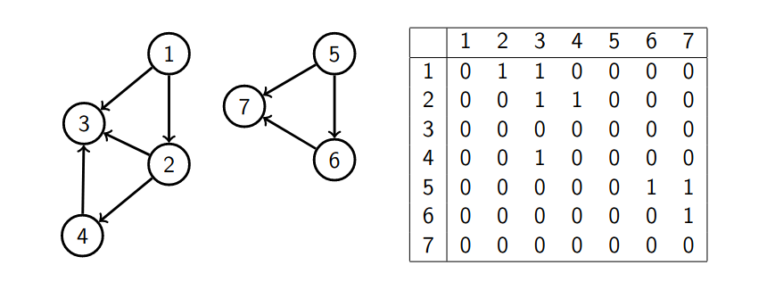{: class="image-center"}

#### Ventajas de usar la matriz de adyacencia

- Es fácil de implementar.
- Ver si dos nodos están conectados es $\mathcal{O}(1)$.
- Agregar y eliminar aristas es $\mathcal{O}(1)$.

#### Desventajas de usar la matriz de adyacencia

- Revisar el _vecindario_ de un nodo es ineficiente ya que hay que revisar toda la fila, $\mathcal{O}(|V|)$.
- En memoria siempre ocupa $\mathcal{O}(|V|^2)$.

### Lista de adyacencia

En la lista de adyacencia, se guarda una lista de vecinos para cada nodo. Es la representación más común.

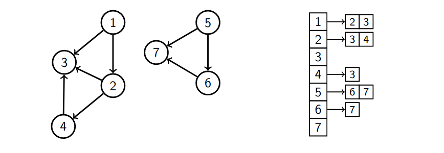{: class="image-center"}

<!-- Poner imagen de la lista de adyacencia. -->

#### Implementación

```cpp
vector<vector<int>> adj; // crea una lista de adyacencia vacia

adj.assign(n, {});       // define el tamaño de la lista de adyacencia
                         // con n nodos y un vector vacio

int u, v;
adj[u].push_back(v);     // agrega un vecino v al nodo u
adj[v].push_back(u);     // si no es dirigido se agrega el vecino u al nodo v

for (int v : adj[u]) {   // recorre los vecinos del nodo u
    cout << v << endl;   // imprime el vecino v
}
```

#### Ventajas de usar la lista de adyacencia

- Recorrer los vecinos de un nodo es lineal en el tamaño de la respuesta.
- El espacio de memoria es $\mathcal{O}(|V| + |E|)$.

#### Desventajas de usar la lista de adyacencia

- Saber si dos nodos conectados es de complejidad lineal.
- Pasa lo mismo con eliminar una arista.

## Grafos implícitos

Algunas veces la estructura de un problema tiene asociado un grafo implícito. Por ejemplo, las casillas a las que puede ir un caballo en un tablero de ajedrez.

{: class="image-center"}

## Algoritmos de búsqueda

### BFS

BFS o búsqueda en anchura es un algoritmo que se usa para recorrer un grafo. Se usa para encontrar el camino más corto entre dos nodos.

El algoritmo se basa en ir visitando los nodos de un grafo de forma que se visiten todos los vecinos de un nodo antes de visitar los vecinos de los vecinos.

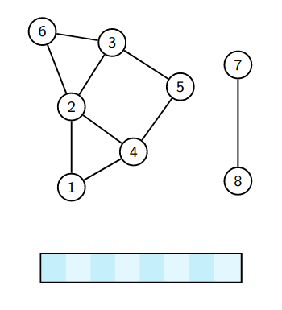{: class="image-center"}

#### Implementación de BFS

Se usa una cola para ir guardando los nodos que se van a visitar. Cuando se visita cada nodo, se va guardando los vecinos aun no visitados de este nodo en la cola.

```cpp
vector<vector<int>> adj;
vector<int> dist;
queue<int> q;

dist.assign(n, -1);
dist[s] = 0;
q.push(s);

while(!q.empty()){
    int u = q.front();
    q.pop();
    for(int v : adj[u]){
        if(dist[v] == -1){
            dist[v] = dist[u] + 1;
            q.push(v);
        }
    }
}
```

Si queremos recuperar el camino, se puede guardar el padre de cada nodo y asi ir recuperando el camino.

```cpp
vector<vector<int>> adj;
vector<int> dist, parent;
queue<int> q;

dist.assign(n, -1);
parent.assign(n, -1);
dist[s] = 0;
q.push(s);

while(!q.empty()){
    int u = q.front();
    q.pop();
    for(int v : adj[u]){
        if(dist[v] == -1){
            dist[v] = dist[u] + 1;
            parent[v] = u;
            q.push(v);
        }
    }
}

vector<int> path;
for(int v = t; v != -1; v = parent[v]){
    path.push_back(v);
}
```

Notas:

- Su complejidad es $\mathcal{O}(|V| + |E|)$. Porque se para en cada nodo y se revisan todas las aristas dos veces, una por cada extremo de la arista.
- Con BFS podemos calcular la distancia de un nodo a todos los demás nodos.

#### Encontrar el diametro de un grafo

El _diámetro_ de un grafo es la distancia máxima entre todos los pares de nodos. Para encontrarlo.

Puede haber más de un camino con el mismo largo que el diámetro.

Encontrar el diámetro en un árbol se puede hacer en tiempo $\mathcal{O}(|V|)$.

- Escogemos un nodo $s$ cualquiera.
- Desde $s$ hacemos bfs para encontrar algún nodo $u$ a distancia máxima.
- Desde $u$ hacemos bfs para encontrar algún nodo $v$ a distancia máxima.
- La distancia entre $u$ y $v$ será el diámetro.

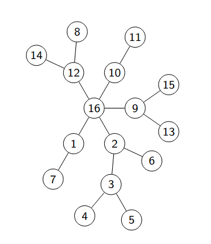{: class="image-center"}

### DFS

DFS es un algoritmo de busqueda en grafos. Se usa para encontrar el camino más corto entre dos nodos, en grafos sin peso.

El algoritmo se basa en ir visitando los nodos de un grafo de forma que se visita el primer vecino de un nodo antes de visitar los vecinos de los vecinos y así sucesivamente.

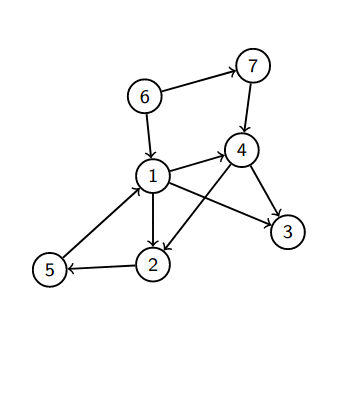{: class="image-center"}

#### Implementación de DFS

Vamos a usar un vector de booleanos para saber si un nodo ya fue visitado o no.

```cpp
vector<vector<int>> adj;
vector<bool> visited;

void dfs(int u){
    visited[u] = true;
    for(int v : adj[u]){
        if(!visited[v]){
            dfs(v);
        }
    }
}
```